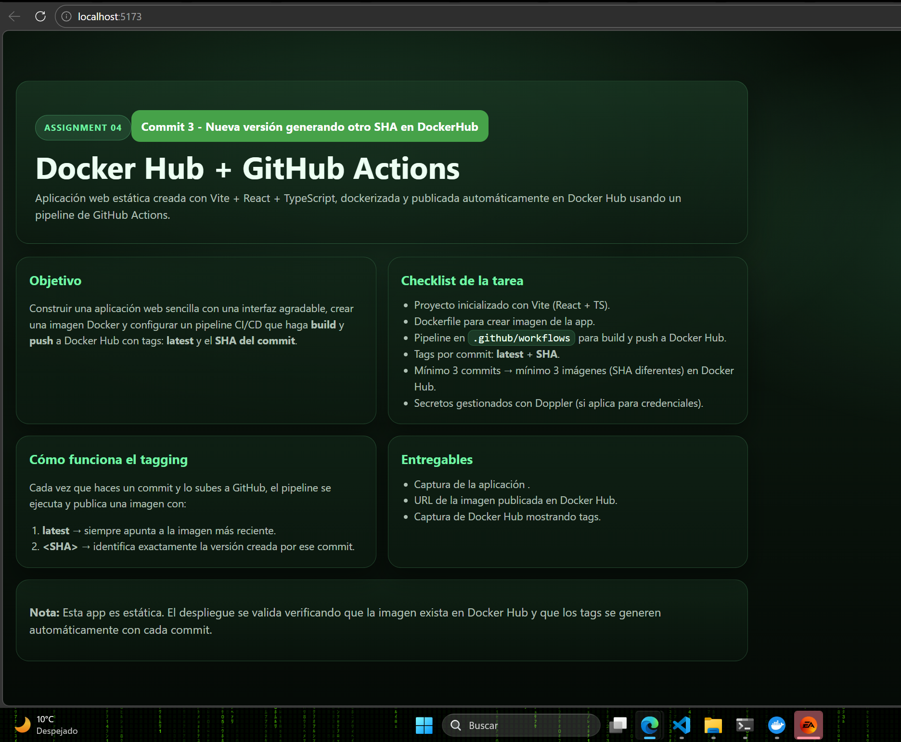
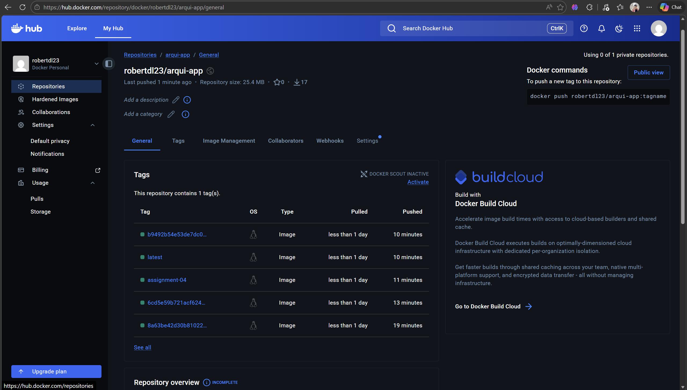

# 📦 Assignment 04 – Docker Hub + GitHub Actions

## 👨‍💻 Autor
Robert De Leon  
Branch de entrega: `assignment-04`

---

#  Descripción del Proyecto

Esta actividad consiste en desarrollar una aplicación web estática utilizando Vite + React + TypeScript, dockerizarla y configurar un pipeline de integración continua (CI/CD) que construya y publique automáticamente la imagen en Docker Hub.

El pipeline debe generar automáticamente:

- 🏷 Tag `latest`
- 🏷 Tag con el SHA del commit
- 🏷 Tag `assignment-04`

Cada commit en la rama `assignment-04` genera una nueva imagen en Docker Hub.

---

#  Captura de la Aplicación

La siguiente imagen muestra la aplicación ejecutándose correctamente:



---

#  Imagen publicada en Docker Hub

Repositorio de la imagen:

 https://hub.docker.com/r/robertdl23/arqui-app

La imagen se genera automáticamente mediante GitHub Actions.

---

#  Evidencia de imágenes y tags en Docker Hub

En la siguiente captura se observan:

- Tag `latest`
- Tag `assignment-04`
- Múltiples tags con SHA distintos (correspondientes a commits diferentes)



---

#  Configuración del Pipeline CI/CD

El workflow se encuentra en:

.github/workflows/assignment-04.yml

Este realiza automáticamente:

1. Checkout del código
2. Login en Docker Hub
3. Build de la imagen Docker
4. Push automático con múltiples tags

Configuración principal del tagging:

```yaml
tags: |
  robertdl23/arqui-app:latest
  robertdl23/arqui-app:${{ github.sha }}