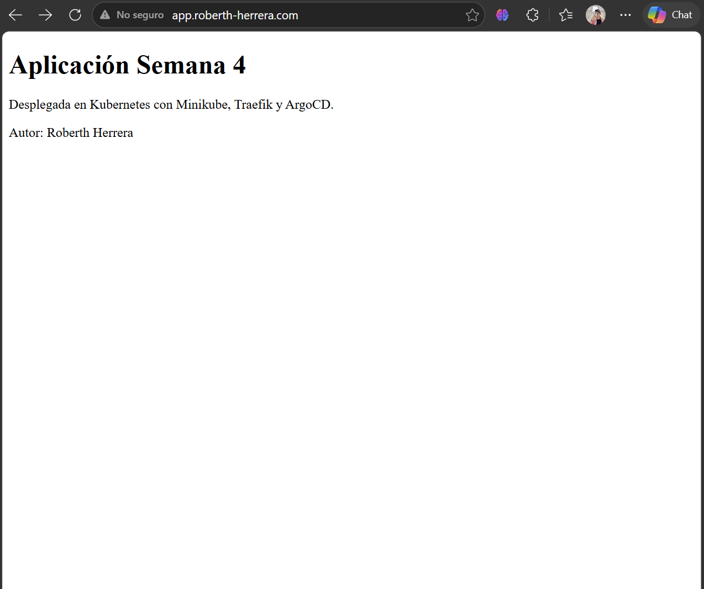
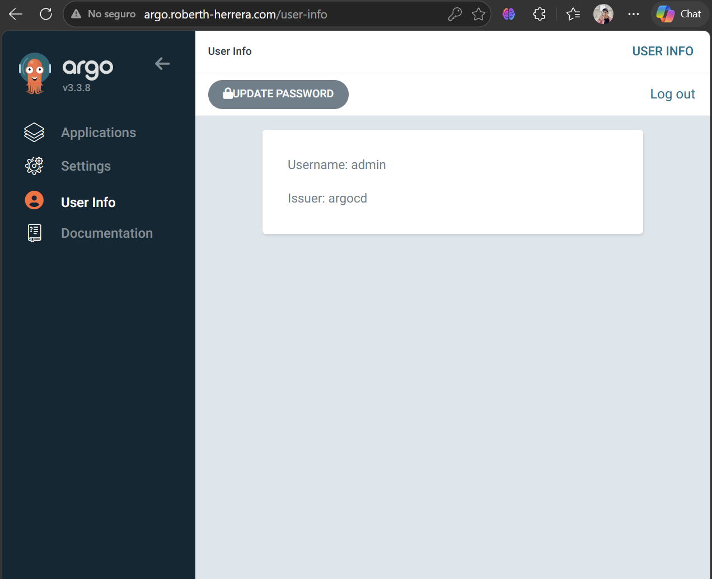
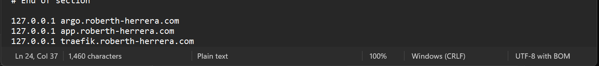

# Assignment 08 – Kubernetes con Minikube, Traefik y ArgoCD

## Captura de la Aplicación



La aplicación fue desplegada en un clúster local de Kubernetes utilizando Minikube, Docker y Traefik como controlador de rutas.  
Se utilizó una aplicación estática servida con Nginx y expuesta mediante un dominio local.

---

## Acceso a la Aplicación

La aplicación puede verificarse en el siguiente dominio local:

http://app.roberth-herrera.com

---

## Captura de ArgoCD



ArgoCD fue instalado dentro del clúster y configurado para ser accesible mediante Traefik utilizando el dominio:

http://argo.roberth-herrera.com

---

## Captura de Configuración DNS Local



Se configuró el archivo `hosts` del sistema operativo para resolver dominios personalizados hacia el clúster de Minikube.

---

## Configuración de DNS Local

Se agregaron las siguientes entradas en el archivo hosts:

```text
127.0.0.1 argo.roberth-herrera.com
127.0.0.1 app.roberth-herrera.com
127.0.0.1 traefik.roberth-herrera.com