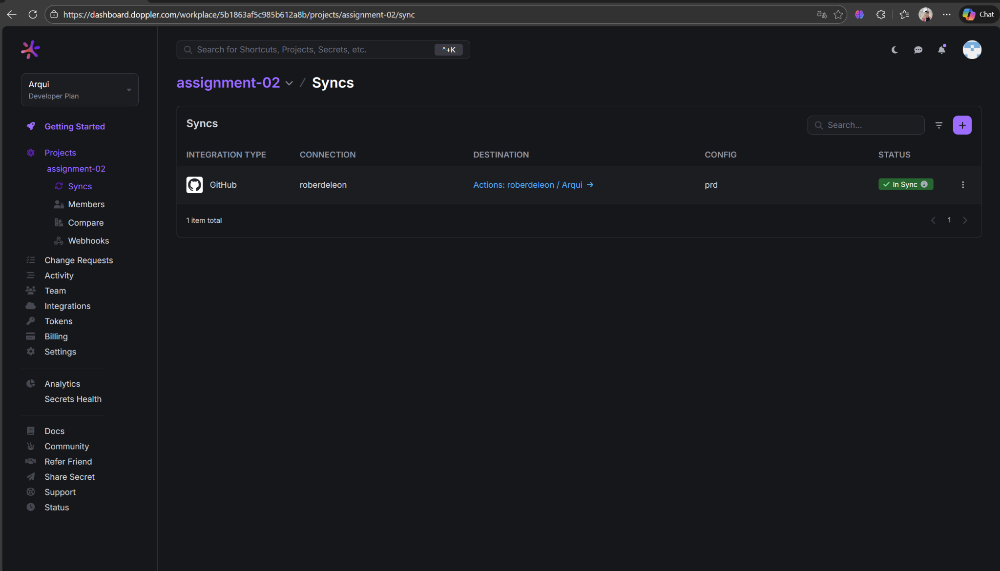
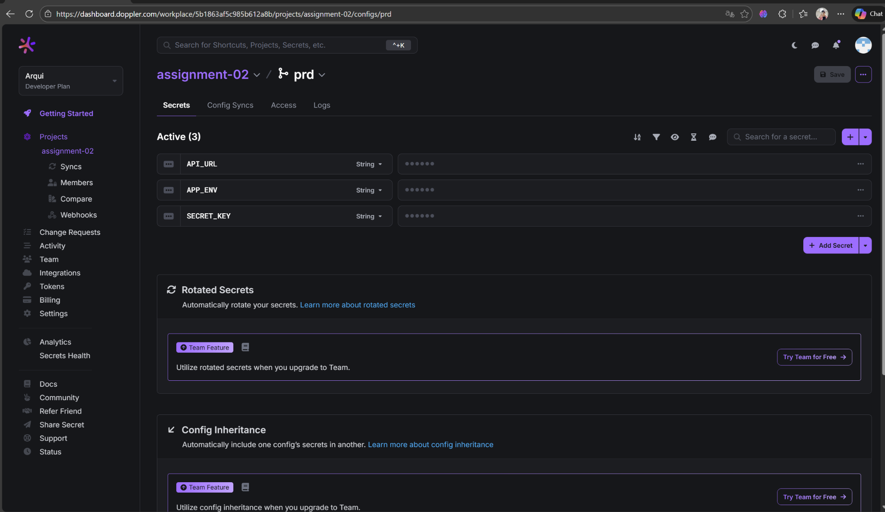
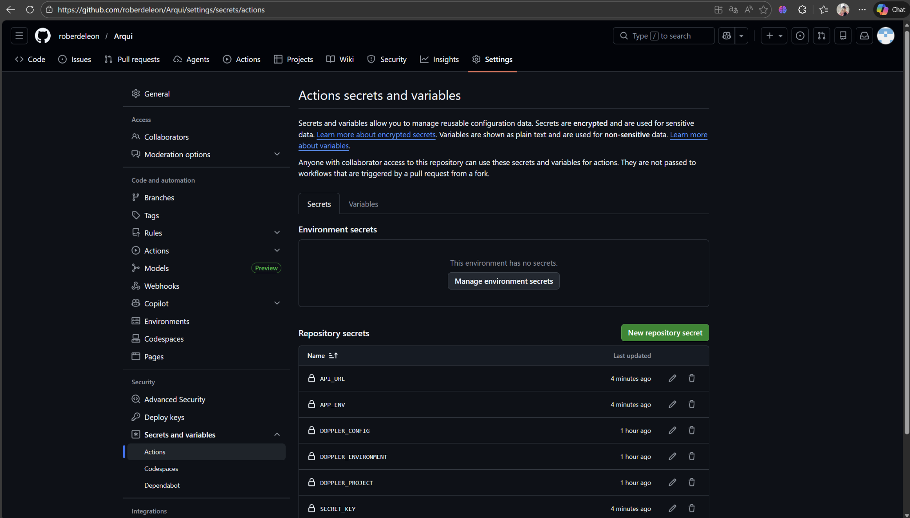
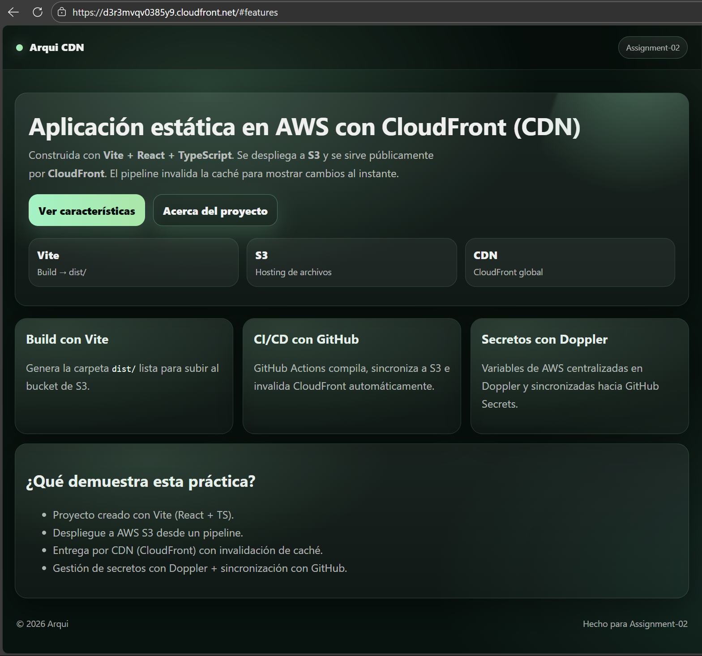

# Assignment-02  
Despliegue de aplicación estática en AWS usando S3, CloudFront, GitHub Actions y Doppler.

---

##  Evidencias del Proyecto

### 1. Integración Doppler - Config Syncs

Configuración de sincronización entre Doppler y el repositorio en GitHub.

---

### 2. Variables configuradas en Doppler

Variables creadas en el entorno `prd` dentro de Doppler (valores ocultos).

---

### 3. Secretos en GitHub Actions

Secretos sincronizados automáticamente desde Doppler hacia GitHub.

---

### 4. Aplicación desplegada y funcionando
Aplicación estática servida desde CloudFront.

---

## 5. URL Pública de la Aplicación

La aplicación se encuentra disponible en:

  https://d3r3mvqv0385y9.cloudfront.net

---

##  Tecnologías utilizadas

- Vite + React + TypeScript
- GitHub Actions (CI/CD)
- Amazon S3
- Amazon CloudFront (CDN)
- Doppler (Gestión de secretos)

---

##  Autor

Robert De Leon Herrera 
 
