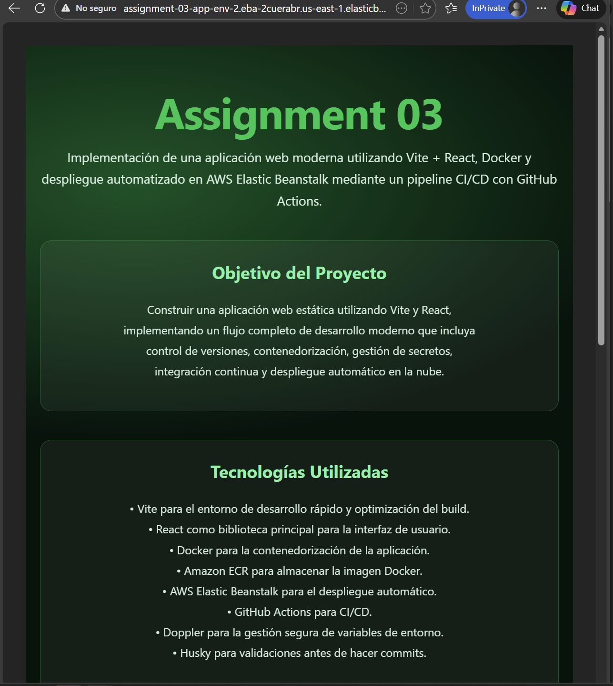
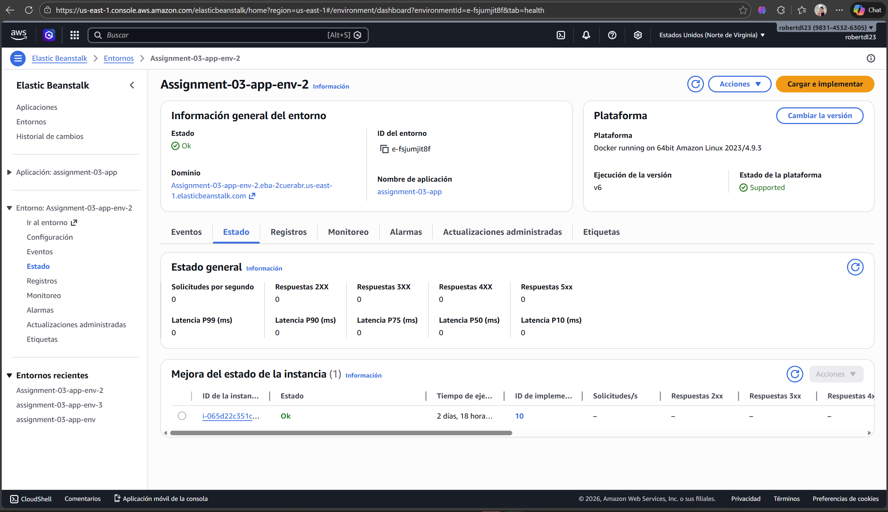

# Assignment 03 – Deploy en AWS Elastic Beanstalk

##  Captura de la Aplicación

La aplicación fue desarrollada con Vite + React y desplegada en AWS Elastic Beanstalk utilizando Docker.

---

##  URL de AWS Elastic Beanstalk

La aplicación puede verificarse en la siguiente URL:

http://assignment-03-app-env-2.eba-2cuerabr.us-east-1.elasticbeanstalk.com/

---

##  Captura de configuración de AWS Beanstalk

El entorno fue configurado usando la plataforma Docker running on 64bit Amazon Linux 2023.

---

##  Uso de Husky

Se implementó Husky para ejecutar validaciones antes de realizar commits.

Husky fue configurado para ejecutar tareas como:

- Validación de estilos (lint)
- Prevención de commits con errores

Esto asegura calidad y consistencia en el código antes de subir cambios al repositorio.

Ejemplo de funcionamiento:

Cuando se realiza un commit, Husky ejecuta automáticamente las reglas configuradas antes de permitir el commit.