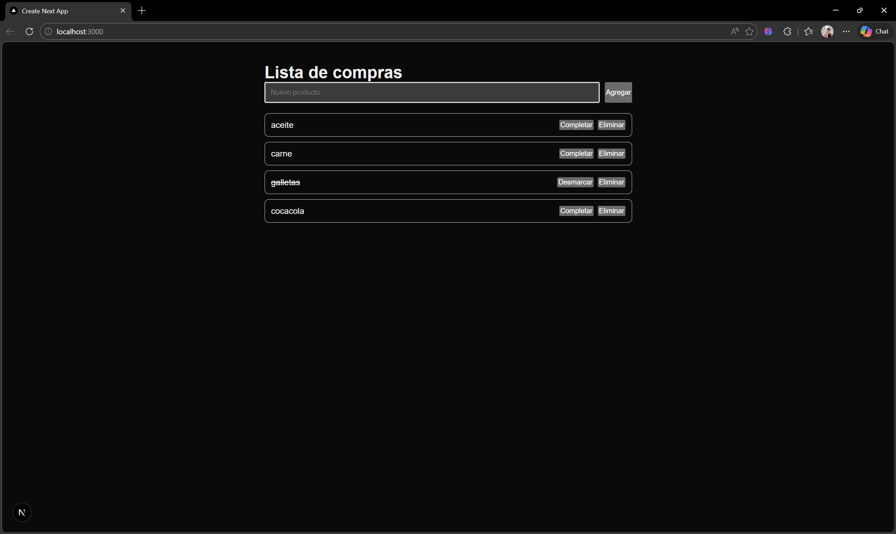
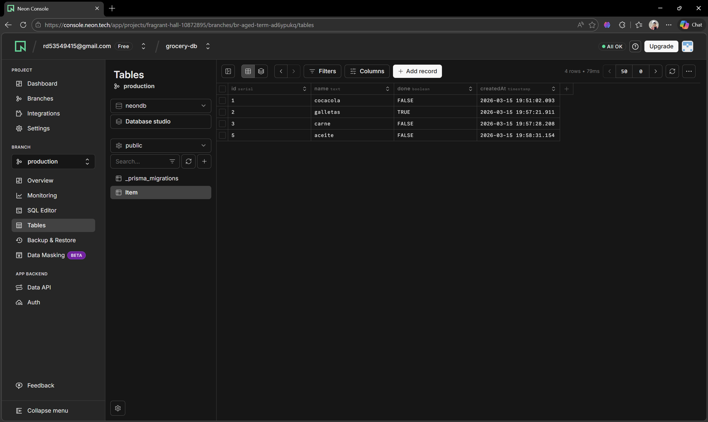
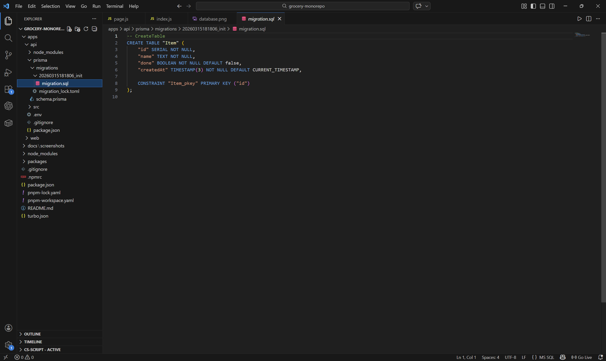
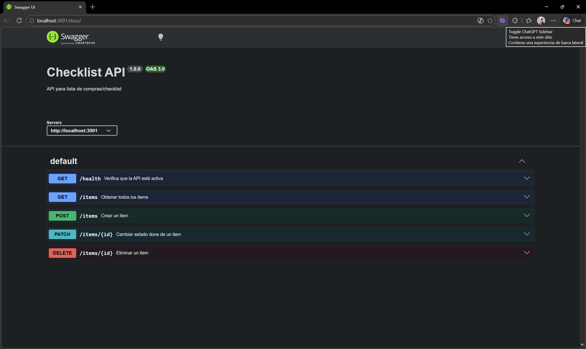

# Assignment 05 – Monorepo App

## Captura de la aplicación

La aplicación fue desarrollada como un monorepo utilizando Turborepo. El frontend fue construido con Next.js, el backend con Express.js y la base de datos con PostgreSQL en Neon. La aplicación permite agregar productos, visualizarlos, marcarlos como completados y eliminarlos.

---

## URL del frontend

https://grocery-web-git-assignment-05-roberdeleons-projects.vercel.app

---

## URL del backend

https://grocery-api-6y0n.onrender.com/health

https://grocery-api-6y0n.onrender.com/items

https://grocery-api-6y0n.onrender.com/docs

---

## Captura de pantalla de la base de datos

La base de datos utilizada en este proyecto fue PostgreSQL desplegada en Neon. La estructura fue gestionada mediante Prisma y corresponde con el modelo `Item` implementado en la aplicación.

---

## Captura de pantalla de las migraciones

Las migraciones fueron generadas con Prisma para reflejar la estructura de la base de datos utilizada por la API.

---

## Documentación de la API

La API cuenta con documentación en Swagger para visualizar y probar los endpoints disponibles del backend.

Endpoints principales implementados:

- `GET /health`
- `GET /items`
- `POST /items`
- `PATCH /items/{id}`
- `DELETE /items/{id}`

---

## Estructura del proyecto

El proyecto fue organizado en estructura monorepo, separando frontend y backend dentro del mismo repositorio para mantener un desarrollo centralizado y ordenado.

Estructura principal:

- `apps/api` → backend con Express.js y Prisma
- `apps/web` → frontend con Next.js
- `docs/screenshots` → capturas utilizadas en el README

---

## Tecnologías utilizadas

- Turborepo
- Next.js
- Express.js
- PostgreSQL
- Neon
- Prisma
- Swagger
- Vercel
- Render
- Github

---

## Rama de trabajo

La entrega fue desarrollada en la rama:

`assignment-05`